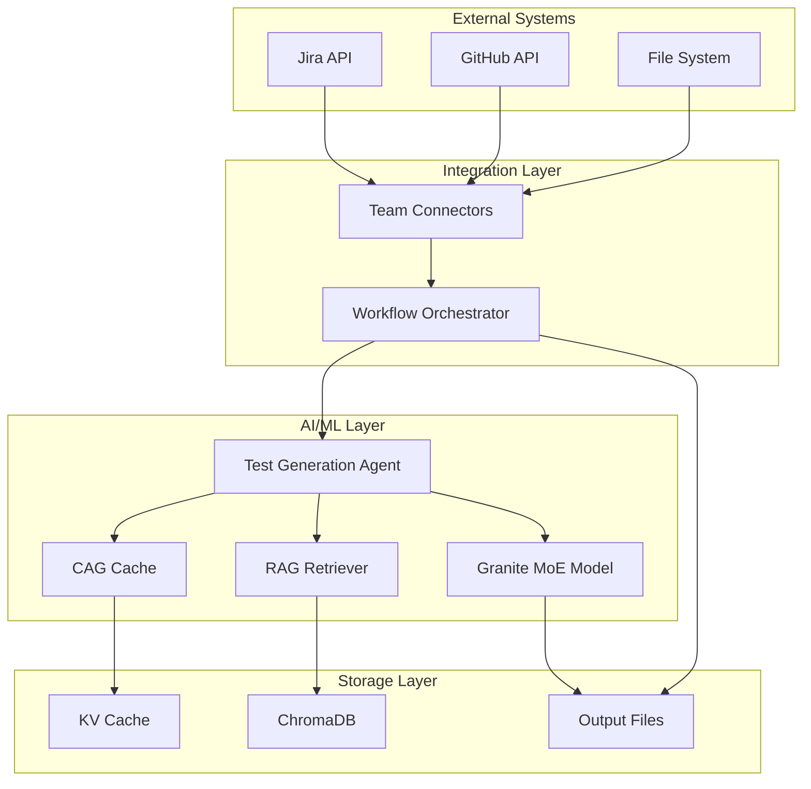
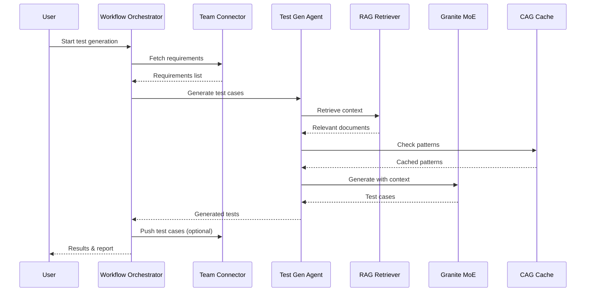
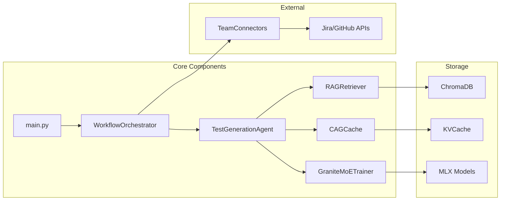
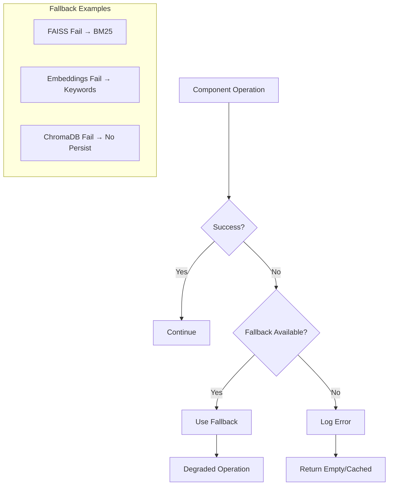
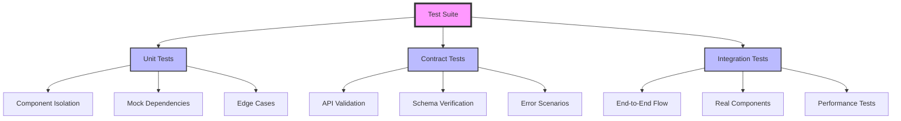

# Architecture Diagrams

## System Overview

```mermaid
graph TB
    subgraph "External Systems"
        JIRA[Jira API]
        GH[GitHub API]
        FS[File System]
    end
    
    subgraph "Integration Layer"
        TC[Team Connectors]
        WO[Workflow Orchestrator]
    end
    
    subgraph "AI/ML Layer"
        TGA[Test Generation Agent]
        GMoE[Granite MoE Model]
        RAG[RAG Retriever]
        CAG[CAG Cache]
    end
    
    subgraph "Storage Layer"
        KV[KV Cache]
        CD[ChromaDB]
        OUT[Output Files]
    end
    
    JIRA --> TC
    GH --> TC
    FS --> TC
    TC --> WO
    WO --> TGA
    TGA --> GMoE
    TGA --> RAG
    TGA --> CAG
    RAG --> CD
    CAG --> KV
    GMoE --> OUT
    WO --> OUT
```

## Data Flow Sequence

```mermaid
sequenceDiagram
    participant U as User
    participant WO as Workflow Orchestrator
    participant TC as Team Connector
    participant TGA as Test Gen Agent
    participant RAG as RAG Retriever
    participant GMoE as Granite MoE
    participant Cache as CAG Cache
    
    U->>WO: Start test generation
    WO->>TC: Fetch requirements
    TC-->>WO: Requirements list
    WO->>TGA: Generate test cases
    TGA->>RAG: Retrieve context
    RAG-->>TGA: Relevant documents
    TGA->>Cache: Check patterns
    Cache-->>TGA: Cached patterns
    TGA->>GMoE: Generate with context
    GMoE-->>TGA: Test cases
    TGA-->>WO: Generated tests
    WO->>TC: Push test cases (optional)
    WO-->>U: Results & report
```

## Component Dependencies

```mermaid
graph LR
    subgraph "Core Components"
        A[main.py] --> B[WorkflowOrchestrator]
        B --> C[TestGenerationAgent]
        C --> D[GraniteMoETrainer]
        C --> E[RAGRetriever]
        C --> F[CAGCache]
    end
    
    subgraph "Storage"
        E --> G[ChromaDB]
        F --> H[KVCache]
        D --> I[MLX Models]
    end
    
    subgraph "External"
        B --> J[TeamConnectors]
        J --> K[Jira/GitHub APIs]
    end
```

## Error Handling Flow

```mermaid
flowchart TD
    A[Component Operation] --> B{Success?}
    B -->|Yes| C[Continue]
    B -->|No| D{Fallback Available?}
    D -->|Yes| E[Use Fallback]
    D -->|No| F[Log Error]
    E --> G[Degraded Operation]
    F --> H[Return Empty/Cached]
    
    subgraph "Fallback Examples"
        I[FAISS Fail → BM25]
        J[Embeddings Fail → Keywords]
        K[ChromaDB Fail → No Persist]
    end
```

## Testing Strategy

```mermaid
graph TD
    A[Test Suite] --> B[Unit Tests]
    A --> C[Contract Tests]
    A --> D[Integration Tests]
    
    B --> B1[Component Isolation]
    B --> B2[Mock Dependencies]
    B --> B3[Edge Cases]
    
    C --> C1[API Validation]
    C --> C2[Schema Verification]
    C --> C3[Error Scenarios]
    
    D --> D1[End-to-End Flow]
    D --> D2[Real Components]
    D --> D3[Performance Tests]
    
    style A fill:#f9f,stroke:#333,stroke-width:4px
    style B fill:#bbf,stroke:#333,stroke-width:2px
    style C fill:#bbf,stroke:#333,stroke-width:2px
    style D fill:#bbf,stroke:#333,stroke-width:2px
```
